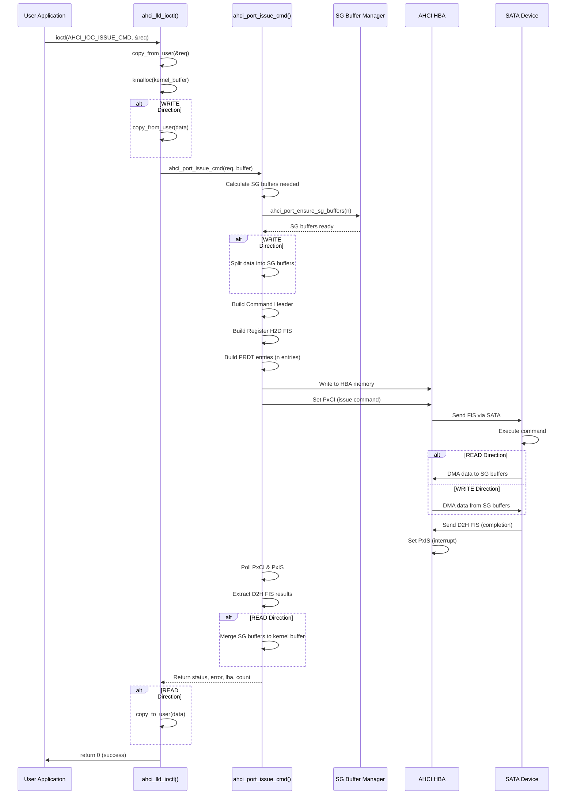
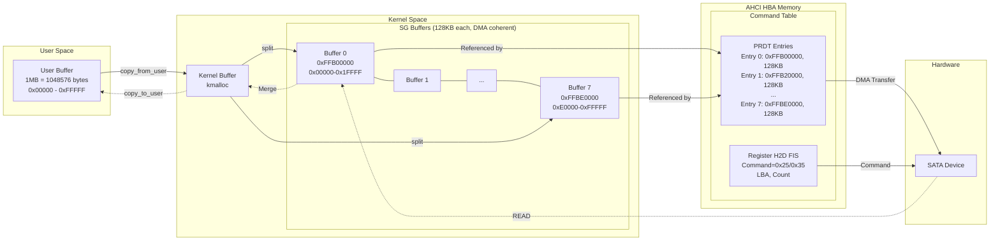
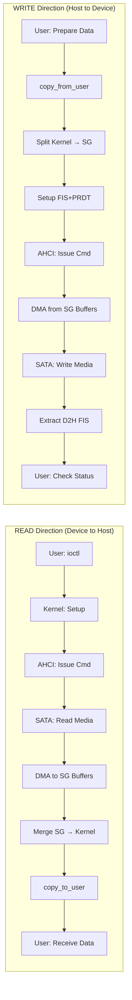
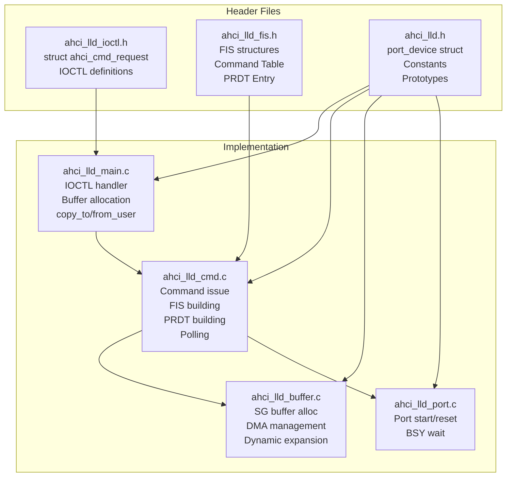
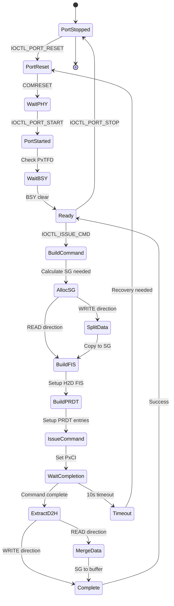

# ATAコマンド発行機能 仕様書

## 概要

AHCI Low Level Driver (ahci_lld)のATAコマンド発行機能の詳細仕様を記述します。
この機能により、ユーザー空間からIOCTLを通じて任意のATAコマンドを発行できます。

### AHCI/SATA仕様準拠

本機能は以下の仕様に基づいて実装されています：

- **AHCI 1.3.1 Specification**
  - Section 4.2: System Memory Structure
  - Section 5: Command List and Command Tables
  - Section 10.5: FIS Types
- **SATA 3.x Specification** - Link Layer, Transport Layer
- **ATA8-ACS** - ATA Command Set

## 機能一覧

- **汎用ATAコマンド発行**: IDENTIFY DEVICE、READ DMA EXT、WRITE DMA EXTなど
- **Scatter-Gather DMA転送**: 最大256MBの大容量データ転送対応（AHCI PRDT使用）
- **D2H FIS結果取得**: コマンド完了後のステータス、エラー、LBA、カウント情報
- **動的バッファ管理**: 転送サイズに応じたDMAバッファの自動割り当て
- **48-bit LBA対応**: 大容量ドライブ（>137GB）をサポート
- **タイムアウト制御**: コマンドごとにタイムアウト値を設定可能

## アーキテクチャ

### コマンド実行フロー



### Scatter-Gather DMAメモリレイアウト



### データフロー (READ vs WRITE)



### モジュール間連携



### 状態遷移図



## IOCTL API

### AHCI_IOC_ISSUE_CMD

ATAコマンドを発行します。

```c
#define AHCI_IOC_ISSUE_CMD  _IOWR(AHCI_LLD_IOC_MAGIC, 10, struct ahci_cmd_request)
```

**引数**: `struct ahci_cmd_request *` (入出力)

**戻り値**: 
- 成功時: 0
- 失敗時: 負のエラーコード
  - `-EFAULT`: ユーザー空間とのデータコピー失敗
  - `-EINVAL`: 無効なパラメータ（バッファサイズ超過など）
  - `-ENOMEM`: メモリ割り当て失敗
  - `-ETIMEDOUT`: コマンドタイムアウト（デフォルト10秒）

## データ構造

### struct ahci_cmd_request

コマンド要求構造体です。

```c
struct ahci_cmd_request {
    /* 入力パラメータ */
    __u8 command;           /* ATAコマンドコード (例: 0xEC=IDENTIFY, 0x25=READ DMA EXT) */
    __u8 features;          /* Featuresレジスタ */
    __u8 device;            /* Deviceレジスタ (通常0x40) */
    __u8 reserved1;
    
    __u64 lba;              /* 48-bit LBA (Logical Block Address) */
    __u16 count;            /* セクタ数 (0=65536セクタ) */
    __u16 reserved2;
    
    __u32 flags;            /* コマンドフラグ */
    
    __u64 buffer;           /* ユーザー空間バッファアドレス */
    __u32 buffer_len;       /* バッファ長（バイト単位） */
    __u32 timeout_ms;       /* タイムアウト（ミリ秒）※未実装、常に10秒 */
    
    /* 出力パラメータ (D2H FISから取得) */
    __u8 status;            /* Statusレジスタ (0x50=DRDY|DSC正常、0x51=エラー) */
    __u8 error;             /* Errorレジスタ */
    __u8 device_out;        /* Deviceレジスタ */
    __u8 reserved3;
    
    __u64 lba_out;          /* 完了時のLBA */
    __u16 count_out;        /* 完了時のセクタ数 */
    __u16 reserved4;
};
```

### コマンドフラグ

```c
#define AHCI_CMD_FLAG_WRITE     (1 << 0)  /* Write direction (H2D): ホストからデバイスへ */
#define AHCI_CMD_FLAG_ATAPI     (1 << 1)  /* ATAPIコマンド ※未実装 */
#define AHCI_CMD_FLAG_PREFETCH  (1 << 2)  /* Prefetchable ※未実装 */
```

- **AHCI_CMD_FLAG_WRITE**: WRITE系コマンド（WRITE DMA EXTなど）で設定
- **フラグなし（0）**: READ系コマンド（READ DMA EXT、IDENTIFYなど）

## Scatter-Gather DMA転送

### 概要

大容量データ転送を効率的に行うため、Scatter-Gather方式を採用しています。

- **SGバッファサイズ**: 128 KB
- **最大SGバッファ数**: 2048個
- **最大転送サイズ**: 256 MB (128KB × 2048)
- **初期割り当て**: 8個 (1 MB)
- **動的拡張**: 必要に応じて追加割り当て

### 動作原理

1. **バッファ割り当て**: ポート初期化時に8個のSGバッファ（1MB分）を事前割り当て
2. **動的拡張**: 転送要求時に必要なSGバッファ数を計算し、不足分を追加割り当て
3. **データ分割**:
   - **WRITE時**: ユーザーバッファ → 複数のSGバッファに分割コピー
   - **READ時**: 複数のSGバッファ → ユーザーバッファに結合コピー
4. **PRDT構築**: 各SGバッファに対応するPRDT (Physical Region Descriptor Table)エントリを生成
5. **DMA転送**: AHCIコントローラが各PRDTエントリを順次処理

### メモリ効率

- 小さい転送（例: 512B）: 1個のSGバッファのみ使用
- 中規模転送（例: 1MB）: 8個のSGバッファ使用
- 大規模転送（例: 256MB）: 2048個まで動的拡張

## FIS (Frame Information Structure)

### Register H2D FIS (ホスト→デバイス)

コマンド発行時に使用します。

```c
struct fis_reg_h2d {
    u8 fis_type;        /* 0x27 = Register H2D FIS */
    u8 flags;           /* bit 7: C (Command/Control) = 1 */
    u8 command;         /* ATAコマンドコード */
    u8 features;        /* Features (7:0) */
    
    u8 lba_low;         /* LBA (7:0) */
    u8 lba_mid;         /* LBA (15:8) */
    u8 lba_high;        /* LBA (23:16) */
    u8 device;          /* Device */
    
    u8 lba_low_exp;     /* LBA (31:24) */
    u8 lba_mid_exp;     /* LBA (39:32) */
    u8 lba_high_exp;    /* LBA (47:40) */
    u8 features_exp;    /* Features (15:8) */
    
    u8 count;           /* Count (7:0) */
    u8 count_exp;       /* Count (15:8) */
    u8 icc;             /* Isochronous Command Completion */
    u8 control;         /* Control */
    
    u32 aux;            /* Auxiliary */
} __packed;
```

### Register D2H FIS (デバイス→ホスト)

コマンド完了時にデバイスから返されます。

```c
struct fis_reg_d2h {
    u8 fis_type;        /* 0x34 = Register D2H FIS */
    u8 flags;           /* bit 6: I (Interrupt) */
    u8 status;          /* Status register */
    u8 error;           /* Error register */
    
    u8 lba_low;         /* LBA (7:0) */
    u8 lba_mid;         /* LBA (15:8) */
    u8 lba_high;        /* LBA (23:16) */
    u8 device;          /* Device */
    
    u8 lba_low_exp;     /* LBA (31:24) */
    u8 lba_mid_exp;     /* LBA (39:32) */
    u8 lba_high_exp;    /* LBA (47:40) */
    u8 reserved1;
    
    u8 count;           /* Count (7:0) */
    u8 count_exp;       /* Count (15:8) */
    u16 reserved2;
    
    u32 reserved3;
} __packed;
```

## サンプルコード

### IDENTIFY DEVICEコマンド

```c
#include <fcntl.h>
#include <sys/ioctl.h>
#include "ahci_lld_ioctl.h"

int main(void)
{
    int fd;
    struct ahci_cmd_request req;
    uint8_t buffer[512];
    
    fd = open("/dev/ahci_lld_p0", O_RDWR);
    if (fd < 0) {
        perror("open");
        return 1;
    }
    
    /* COMRESET & Port Start */
    ioctl(fd, AHCI_IOC_PORT_RESET, NULL);
    ioctl(fd, AHCI_IOC_PORT_START, NULL);
    
    /* IDENTIFY DEVICE */
    memset(&req, 0, sizeof(req));
    req.command = 0xEC;                              /* IDENTIFY DEVICE */
    req.device = 0x40;                               /* LBA mode */
    req.buffer = (__u64)(unsigned long)buffer;
    req.buffer_len = 512;
    req.flags = 0;                                   /* READ direction */
    
    if (ioctl(fd, AHCI_IOC_ISSUE_CMD, &req) < 0) {
        perror("ioctl IDENTIFY");
        close(fd);
        return 1;
    }
    
    printf("Status: 0x%02x, Error: 0x%02x\n", req.status, req.error);
    
    /* Parse IDENTIFY data */
    char model[41];
    memcpy(model, &buffer[54], 40);
    model[40] = '\0';
    /* Swap byte order */
    for (int i = 0; i < 40; i += 2) {
        char tmp = model[i];
        model[i] = model[i+1];
        model[i+1] = tmp;
    }
    printf("Model: %s\n", model);
    
    close(fd);
    return 0;
}
```

### READ DMA EXTコマンド

```c
int read_sectors(int fd, uint64_t lba, uint16_t count, void *buffer)
{
    struct ahci_cmd_request req;
    
    memset(&req, 0, sizeof(req));
    req.command = 0x25;                              /* READ DMA EXT */
    req.device = 0x40;                               /* LBA mode */
    req.lba = lba;
    req.count = count;
    req.buffer = (__u64)(unsigned long)buffer;
    req.buffer_len = count * 512;
    req.flags = 0;                                   /* READ direction */
    
    if (ioctl(fd, AHCI_IOC_ISSUE_CMD, &req) < 0) {
        perror("ioctl READ DMA EXT");
        return -1;
    }
    
    if (req.status != 0x50) {
        fprintf(stderr, "Command failed: status=0x%02x error=0x%02x\n",
                req.status, req.error);
        return -1;
    }
    
    return 0;
}
```

### WRITE DMA EXTコマンド

```c
int write_sectors(int fd, uint64_t lba, uint16_t count, const void *buffer)
{
    struct ahci_cmd_request req;
    
    memset(&req, 0, sizeof(req));
    req.command = 0x35;                              /* WRITE DMA EXT */
    req.device = 0x40;                               /* LBA mode */
    req.lba = lba;
    req.count = count;
    req.buffer = (__u64)(unsigned long)buffer;
    req.buffer_len = count * 512;
    req.flags = AHCI_CMD_FLAG_WRITE;                 /* WRITE direction */
    
    if (ioctl(fd, AHCI_IOC_ISSUE_CMD, &req) < 0) {
        perror("ioctl WRITE DMA EXT");
        return -1;
    }
    
    if (req.status != 0x50) {
        fprintf(stderr, "Command failed: status=0x%02x error=0x%02x\n",
                req.status, req.error);
        return -1;
    }
    
    return 0;
}
```

### 大容量転送（1MB）

```c
int main(void)
{
    int fd;
    uint8_t *buffer;
    int ret;
    
    buffer = malloc(1024 * 1024);  /* 1MB = 2048 sectors */
    if (!buffer) {
        perror("malloc");
        return 1;
    }
    
    fd = open("/dev/ahci_lld_p0", O_RDWR);
    if (fd < 0) {
        perror("open");
        free(buffer);
        return 1;
    }
    
    /* COMRESET & Port Start */
    ioctl(fd, AHCI_IOC_PORT_RESET, NULL);
    ioctl(fd, AHCI_IOC_PORT_START, NULL);
    
    /* Read 1MB (2048 sectors) from LBA 100 */
    /* 内部的に8個のSGバッファ（128KB×8）、8個のPRDTエントリを使用 */
    ret = read_sectors(fd, 100, 2048, buffer);
    
    if (ret == 0) {
        printf("Successfully read 1MB\n");
        /* Process data... */
    }
    
    close(fd);
    free(buffer);
    return ret;
}
```

## ステータスコード

### Status Register (req.status)

| ビット | 名前 | 説明 |
|--------|------|------|
| 7 | BSY  | Busy（デバイスビジー） |
| 6 | DRDY | Device Ready（デバイス準備完了） |
| 5 | DF   | Device Fault（デバイス障害） |
| 4 | DSC  | Device Seek Complete |
| 3 | DRQ  | Data Request（データ転送要求） |
| 0 | ERR  | Error（エラー発生） |

**正常完了**: `0x50` (DRDY=1, DSC=1)  
**エラー**: `0x51` (DRDY=1, DSC=1, ERR=1)

### Error Register (req.error)

エラー時（status & ERR）のみ有効です。

| ビット | 名前 | 説明 |
|--------|------|------|
| 7 | BBK  | Bad Block（不良ブロック） |
| 6 | UNC  | Uncorrectable Data Error（訂正不能データエラー） |
| 5 | MC   | Media Changed |
| 4 | IDNF | ID Not Found（IDが見つからない） |
| 3 | MCR  | Media Change Request |
| 2 | ABRT | Aborted Command（コマンド中止） |
| 1 | TK0NF| Track 0 Not Found |
| 0 | AMNF | Address Mark Not Found |

## エラーハンドリング

### タイムアウト処理

コマンドが10秒以内に完了しない場合、`-ETIMEDOUT`が返されます。

```c
if (ioctl(fd, AHCI_IOC_ISSUE_CMD, &req) < 0) {
    if (errno == ETIMEDOUT) {
        fprintf(stderr, "Command timeout\n");
        /* Port reset may be required */
        ioctl(fd, AHCI_IOC_PORT_RESET, NULL);
        ioctl(fd, AHCI_IOC_PORT_START, NULL);
    }
}
```

### コマンドエラー

```c
if (ioctl(fd, AHCI_IOC_ISSUE_CMD, &req) == 0) {
    if (req.status & 0x01) {  /* ERR bit set */
        fprintf(stderr, "ATA Error: status=0x%02x error=0x%02x\n",
                req.status, req.error);
        
        if (req.error & 0x04) {  /* ABRT */
            fprintf(stderr, "Command aborted\n");
        }
        if (req.error & 0x40) {  /* UNC */
            fprintf(stderr, "Uncorrectable data error at LBA 0x%llx\n",
                    req.lba_out);
        }
    }
}
```

## 制限事項

1. **同時発行**: 1ポートにつき1コマンドのみ（NCQ未対応）
2. **タイムアウト**: 固定10秒（`timeout_ms`フィールドは未実装）
3. **ATAPI**: 未対応
4. **Port Multiplier**: 未対応
5. **最大転送サイズ**: 256MB（`AHCI_SG_BUFFER_SIZE * AHCI_SG_BUFFER_COUNT`）

## パフォーマンス

### 転送速度

実測値（WDC WD5000AZLX-08K2TA0、SATA Gen3）:

- **1MB転送（READ DMA EXT）**: 約5.5ms
- **1MB転送（WRITE DMA EXT）**: 約5.5ms
- **スループット**: 約180 MB/s

### オーバーヘッド

- **SGバッファ確保**: 初回のみ、以降はキャッシュ使用
- **データコピー**: ユーザー空間↔カーネル↔SGバッファの2段階コピー
- **PRDT構築**: O(n)、nはSGバッファ数

## トラブルシューティング

### "Buffer too large" エラー

```
ahci_lld ahci_lld_p0: Buffer too large: 268435456 > 268435456
```

転送サイズが256MBを超えています。複数回に分けて転送してください。

### "Command timeout"

```
ahci_lld ahci_lld_p0: Command timeout (PxCI=0x00000001 PxIS=0x00000000)
```

デバイスが応答しません。以下を確認してください：

1. COMRESETとPort Startが正しく実行されているか
2. デバイスがBUSY状態でないか（PxTFD確認）
3. ケーブル接続、電源供給が正常か

### Scatter-Gather割り当て失敗

```
ahci_lld ahci_lld_p0: Failed to allocate SG buffer 9
```

DMAメモリが不足しています。以下を試してください：

1. システムメモリを増設
2. 転送サイズを小さくする
3. 他のDMA使用デバイスを停止

## 参考仕様

- **AHCI Specification**: Revision 1.3.1
  - Section 4.2.2: Command List Structure
  - Section 4.2.3: Command Table
  - Section 5.5: Command Execution
  
- **SATA Specification**: Revision 3.5 Gold
  - Section 10.5: Frame Information Structure (FIS) Types
  - Section 13.2: IDENTIFY DEVICE
  - Section 13.6: READ DMA EXT
  - Section 13.9: WRITE DMA EXT

## 変更履歴

- **2025-12-07**: 初版作成
  - 基本的なコマンド発行機能
  - Scatter-Gather DMA転送（128KB×2048）
  - D2H FIS結果取得
