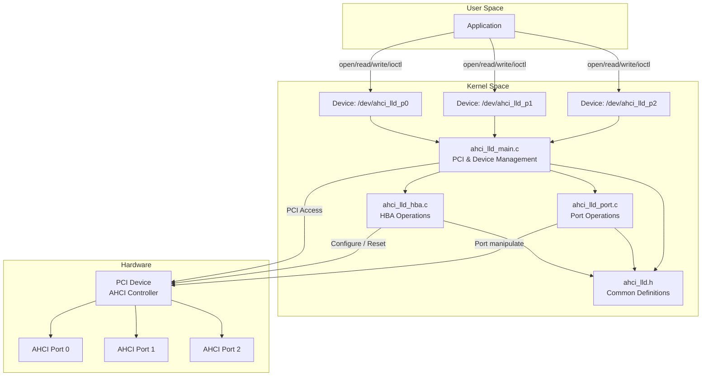

# AHCI Low Level Driver (ahci_lld)

## 概要

AHCI Low Level Driverは、AHCIコントローラーの各ポートを独立したキャラクタデバイスとして公開するLinux kernelドライバーです。従来のブロックデバイスとしてではなく、キャラクタデバイスとして実装することで、ポートレベルでの直接的な制御を可能にします。

## アーキテクチャ



## モジュール構成

### ファイル構成

```
ahci_lld/
├── ahci_lld.h              # 共通ヘッダーファイル
├── ahci_lld_main.c         # メインモジュール（PCI、デバイス管理）
├── ahci_lld_hba.c          # HBA操作モジュール
├── ahci_lld_port.c         # ポート操作モジュール
├── ahci_lld_buffer.c       # DMAバッファ管理（未実装）
├── Makefile                # ビルド設定
└── README.md               # このファイル
```

### モジュール間の責務分離

| モジュール | 責務 |
|-----------|------|
| `ahci_lld_main.c` | PCIデバイスの検出・登録、キャラクタデバイスの作成・管理、ドライバーのライフサイクル管理 |
| `ahci_lld_hba.c` | HBAレベルの操作（リセット、AHCI有効化、グローバル設定） |
| `ahci_lld_port.c` | ポートレベルの操作（初期化、クリーンアップ、コマンド実行） |
| `ahci_lld_buffer.c` | Data IO用DMAバッファの割り当て・管理（将来実装予定） |

## データ構造

### `struct ahci_hba`

HBAの状態を管理する構造体。

```c
struct ahci_hba {
    struct pci_dev *pdev;                      // PCIデバイス
    void __iomem *mmio;                        // MMIO領域のベースアドレス
    size_t mmio_size;                          // MMIO領域のサイズ
    
    u32 ports_impl;                            // Ports Implemented (PI) レジスタ値
    int n_ports;                               // 実装されているポート数
    
    struct ahci_port_device *ports[AHCI_MAX_PORTS];  // ポートデバイスの配列
    
    dev_t dev_base;                            // デバイス番号のベース
    struct class *class;                       // デバイスクラス
};
```

### `struct ahci_port_device`

各ポートのキャラクタデバイス情報を管理する構造体。

```c
struct ahci_port_device {
    struct cdev cdev;                          // キャラクタデバイス
    struct device *device;                     // デバイスオブジェクト
    dev_t devno;                               // デバイス番号
    int port_no;                               // ポート番号
    void __iomem *port_mmio;                   // ポートMMIO領域
    struct ahci_hba *hba;                      // 親HBA構造体へのポインタ
};
```

## 関数リファレンス

### ahci_lld_main.c

#### モジュール初期化・終了

##### `ahci_lld_init()`
```c
static int __init ahci_lld_init(void)
```
**役割**: ドライバーモジュールの初期化  
**処理内容**:
1. キャラクタデバイスのメジャー番号を動的に割り当て
2. デバイスクラス `/sys/class/ahci_lld` を作成
3. PCIドライバーを登録

**返り値**:
- `0`: 成功
- 負の値: エラーコード

---

##### `ahci_lld_exit()`
```c
static void __exit ahci_lld_exit(void)
```
**役割**: ドライバーモジュールの終了処理  
**処理内容**:
1. PCIドライバーの登録解除
2. デバイスクラスの破棄
3. キャラクタデバイスの登録解除

---

#### PCIドライバー関数

##### `ahci_lld_probe()`
```c
static int ahci_lld_probe(struct pci_dev *pdev, const struct pci_device_id *ent)
```
**役割**: PCIデバイスが検出された際の初期化処理  
**処理内容**:
1. HBA構造体の割り当て
2. PCIデバイスの有効化
3. バスマスタDMAの有効化
4. PCI領域（BAR5）の要求とMMIOマッピング
5. HBAのリセットとAHCIモード有効化（`ahci_hba_reset()`, `ahci_hba_enable()`呼び出し）
6. Ports Implemented (PI) レジスタの読み取り
7. 実装されているポートごとにキャラクタデバイスを作成

**引数**:
- `pdev`: 検出されたPCIデバイス
- `ent`: マッチしたPCI IDエントリ

**返り値**:
- `0`: 成功
- 負の値: エラーコード

**エラー処理**: リソース確保失敗時は、確保済みリソースを逆順で解放

---

##### `ahci_lld_remove()`
```c
static void ahci_lld_remove(struct pci_dev *pdev)
```
**役割**: PCIデバイスが取り外された際のクリーンアップ  
**処理内容**:
1. 全ポートデバイスの破棄
2. MMIOマッピングの解除
3. PCI領域の解放
4. PCIデバイスの無効化
5. HBA構造体の解放

**引数**:
- `pdev`: 取り外されるPCIデバイス

---

#### ポートデバイス管理

##### `ahci_create_port_device()`
```c
static int ahci_create_port_device(struct ahci_hba *hba, int port_no)
```
**役割**: 指定されたポート番号のキャラクタデバイスを作成  
**処理内容**:
1. `ahci_port_device`構造体の割り当て
2. ポート番号とMMIOアドレスの設定
3. キャラクタデバイス（cdev）の初期化と追加
4. `/dev/ahci_lld_pX` デバイスノードの作成
5. HBAのポート配列に登録

**引数**:
- `hba`: HBA構造体
- `port_no`: ポート番号（0-31）

**返り値**:
- `0`: 成功
- 負の値: エラーコード

**デバイス名**: `/dev/ahci_lld_p{port_no}`

---

##### `ahci_destroy_port_device()`
```c
static void ahci_destroy_port_device(struct ahci_hba *hba, int port_no)
```
**役割**: 指定されたポート番号のキャラクタデバイスを破棄  
**処理内容**:
1. デバイスノードの削除
2. キャラクタデバイスの削除
3. `ahci_port_device`構造体の解放

**引数**:
- `hba`: HBA構造体
- `port_no`: ポート番号（0-31）

---

#### ファイルオペレーション

##### `ahci_lld_open()`
```c
static int ahci_lld_open(struct inode *inode, struct file *file)
```
**役割**: デバイスファイルのオープン処理  
**処理内容**:
1. `inode`からポートデバイス構造体を取得
2. `file->private_data`にポートデバイスへのポインタを保存
3. オープンログを出力

**返り値**: 常に `0` （成功）

---

##### `ahci_lld_release()`
```c
static int ahci_lld_release(struct inode *inode, struct file *file)
```
**役割**: デバイスファイルのクローズ処理  
**処理内容**:
1. クローズログを出力

**返り値**: 常に `0` （成功）

---

##### `ahci_lld_read()`
```c
static ssize_t ahci_lld_read(struct file *file, char __user *buf,
                              size_t count, loff_t *ppos)
```
**役割**: デバイスからのデータ読み取り（将来実装予定）  
**現在の実装**: スタブ

**返り値**: `-EINVAL` （未実装）

---

##### `ahci_lld_write()`
```c
static ssize_t ahci_lld_write(struct file *file, const char __user *buf,
                               size_t count, loff_t *ppos)
```
**役割**: デバイスへのデータ書き込み（将来実装予定）  
**現在の実装**: スタブ

**返り値**: `-EINVAL` （未実装）

---

##### `ahci_lld_ioctl()`
```c
static long ahci_lld_ioctl(struct file *file, unsigned int cmd,
                            unsigned long arg)
```
**役割**: デバイス制御コマンドの実行（将来実装予定）  
**現在の実装**: スタブ

**返り値**: `-ENOTTY` （未実装）

---

### ahci_lld_hba.c

#### HBA操作関数

##### `ahci_hba_reset()`
```c
int ahci_hba_reset(struct ahci_hba *hba)
```
**役割**: HBAのハードウェアリセットを実行  
**処理内容**:
1. GHC (Global HBA Control) レジスタの HR (HBA Reset) ビットをセット
2. HRビットがクリアされるまで待機（最大1000ms）
3. タイムアウトチェック

**仕様準拠**: AHCI仕様 Section 10.4.2 HBA Reset

**引数**:
- `hba`: HBA構造体

**返り値**:
- `0`: 成功
- `-ETIMEDOUT`: リセットタイムアウト

**タイミング**: 
- リセット完了までの待機: 最大1000ms
- ポーリング間隔: 1ms

**レジスタ操作**:
- `GHC (0x04)`: HR bit (bit 0) をセット/クリア確認

---

##### `ahci_hba_enable()`
```c
int ahci_hba_enable(struct ahci_hba *hba)
```
**役割**: AHCIモードを有効化  
**処理内容**:
1. GHC (Global HBA Control) レジスタの AE (AHCI Enable) ビットをセット
2. AEビットがセットされたことを確認

**仕様準拠**: AHCI仕様 Section 3.1.1 GHC - Global HBA Control

**引数**:
- `hba`: HBA構造体

**返り値**:
- `0`: 成功
- `-EIO`: AHCI有効化失敗

**レジスタ操作**:
- `GHC (0x04)`: AE bit (bit 31) をセット/確認

**注意**: 
- リセット後はAEビットがクリアされるため、必ず`ahci_hba_reset()`の後に実行する必要がある

---

### ahci_lld_port.c

#### ポート操作関数

##### `ahci_port_init()`
```c
int ahci_port_init(struct ahci_port_device *port)
```
**役割**: ポートの初期化処理（将来実装予定）  
**予定処理内容**:
1. PxCMD.ST/FRE がクリアされていることを確認
2. Command List Base Address (PxCLB/PxCLBU) の設定
3. FIS Base Address (PxFB/PxFBU) の設定
4. PxSERR (Port x SATA Error) レジスタのクリア
5. PxIS (Port x Interrupt Status) レジスタのクリア
6. PxCMD.FRE (FIS Receive Enable) の有効化
7. PxCMD.ST (Start) の有効化

**仕様準拠**: AHCI仕様 Section 10.3 Port Initialization

**引数**:
- `port`: ポートデバイス構造体

**返り値**:
- `0`: 成功
- 負の値: エラーコード（将来実装）

**現在の実装**: ログ出力のみ

---

##### `ahci_port_cleanup()`
```c
void ahci_port_cleanup(struct ahci_port_device *port)
```
**役割**: ポートのクリーンアップ処理（将来実装予定）  
**予定処理内容**:
1. PxCMD.ST (Start) のクリア
2. PxCMD.CR (Command List Running) がクリアされるまで待機
3. PxCMD.FRE (FIS Receive Enable) のクリア
4. PxCMD.FR (FIS Receive Running) がクリアされるまで待機
5. DMAバッファの解放

**仕様準拠**: AHCI仕様 Section 10.3.2 Port Stop

**引数**:
- `port`: ポートデバイス構造体

**現在の実装**: ログ出力のみ

---

## レジスタマップ

### Generic Host Control レジスタ

| オフセット | 名前 | 説明 |
|-----------|------|------|
| 0x00 | CAP | HBA Capabilities |
| 0x04 | GHC | Global HBA Control |
| 0x08 | IS | Interrupt Status |
| 0x0C | PI | Ports Implemented |

### Port レジスタ (Base + 0x100 + port * 0x80)

| オフセット | 名前 | 説明 |
|-----------|------|------|
| 0x00 | PxCLB | Command List Base Address |
| 0x04 | PxCLBU | Command List Base Address Upper 32-bits |
| 0x08 | PxFB | FIS Base Address |
| 0x0C | PxFBU | FIS Base Address Upper 32-bits |
| 0x10 | PxIS | Interrupt Status |
| 0x14 | PxIE | Interrupt Enable |
| 0x18 | PxCMD | Command and Status |
| 0x20 | PxTFD | Task File Data |
| 0x28 | PxSSTS | SATA Status |
| 0x2C | PxSCTL | SATA Control |
| 0x30 | PxSERR | SATA Error |
| 0x34 | PxSACT | SATA Active |
| 0x38 | PxCI | Command Issue |

## ビルド方法

```bash
# モジュールのビルド
make

# モジュールのロード
sudo insmod ahci_lld.ko

# または make経由
make load

# モジュールのアンロード
sudo rmmod ahci_lld

# または make経由
make unload

# クリーンビルド
make clean
```

## 使用方法

### 1. 既存ドライバーのアンバインド

```bash
# SATAコントローラーのPCIアドレスを確認
lspci | grep SATA

# 既存ドライバーからアンバインド（例: 0000:00:17.0）
echo "0000:00:17.0" | sudo tee /sys/bus/pci/drivers/ahci/unbind
```

### 2. ドライバーのロード

```bash
sudo insmod ahci_lld.ko
```

### 3. デバイスの確認

```bash
# デバイスファイルの確認
ls -l /dev/ahci_lld*

# カーネルログの確認
dmesg | tail

# バインド状態の確認
lspci -k -s 00:17.0
```

### 4. デバイスのオープン（テスト）

```bash
# ポート0を開く（rootまたは適切な権限が必要）
sudo cat /dev/ahci_lld_p0
```

## 動作確認済み環境

- カーネルバージョン: 6.14.0-36-generic
- ディストリビューション: Ubuntu 24.04
- コントローラー: Intel Cannon Lake PCH SATA AHCI Controller (8086:a352)

## 今後の実装予定

### 短期（フェーズ1）
- [ ] DMAバッファ管理の実装 (`ahci_lld_buffer.c`)
- [ ] ポート初期化処理の実装
- [ ] Command List / FIS 構造体の定義

### 中期（フェーズ2）
- [ ] IDENTIFY DEVICE コマンドの実装
- [ ] READ/WRITE コマンドの実装
- [ ] ioctlインターフェースの設計・実装
- [ ] エラーハンドリングの強化

### 長期（フェーズ3）
- [ ] NCQ (Native Command Queuing) サポート
- [ ] ホットプラグ対応
- [ ] パワーマネジメント
- [ ] 割り込みハンドラの実装

## ライセンス

GPL v2

## 参考資料

- [Serial ATA AHCI Specification](https://www.intel.com/content/www/us/en/io/serial-ata/ahci.html)
- Linux Kernel Documentation: drivers/ata/
