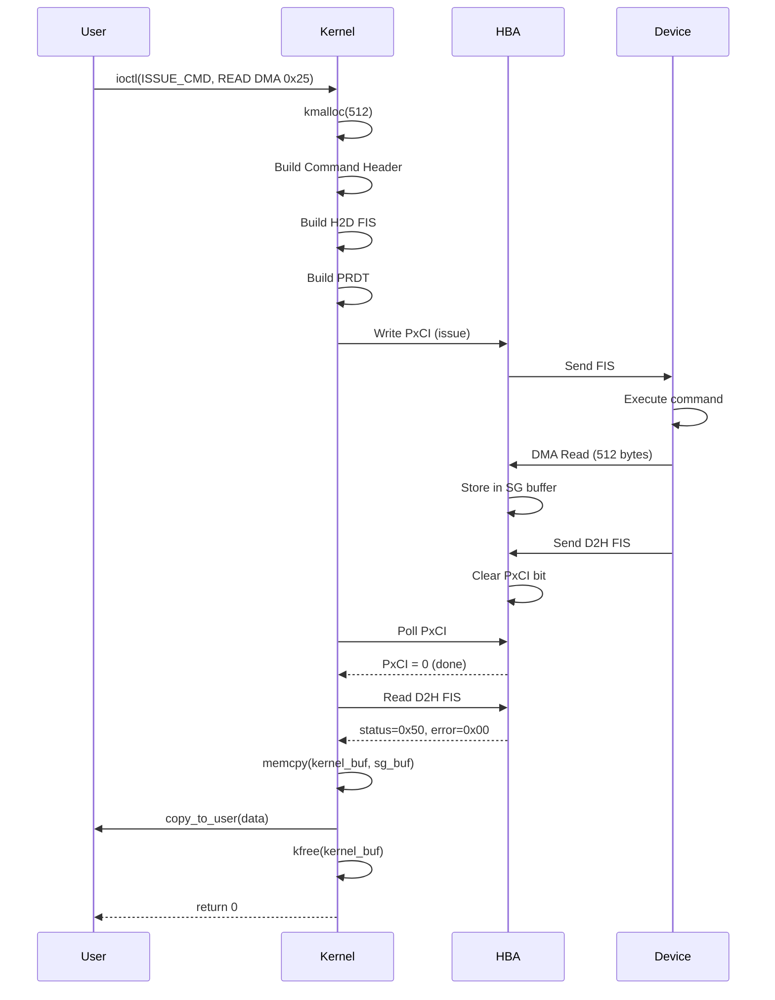
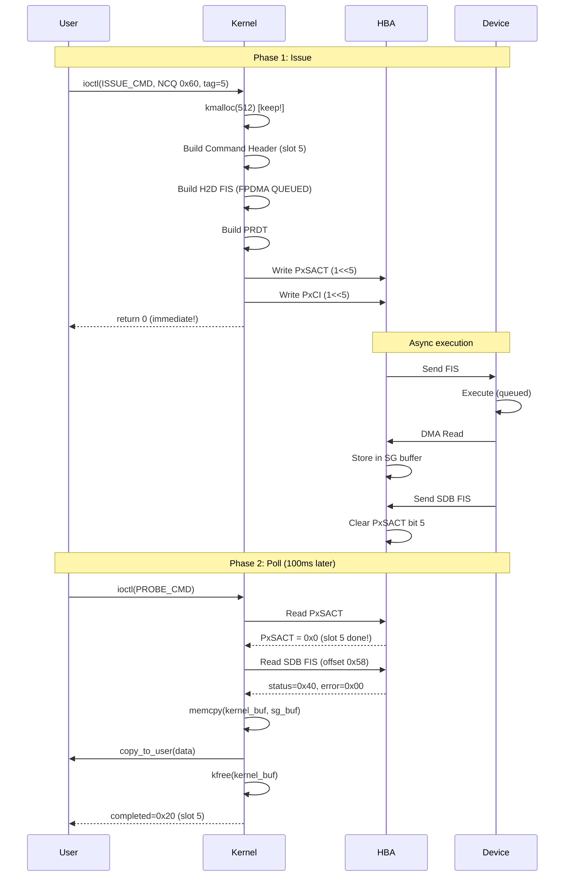

# AHCI LLD 動作フロー仕様書

**AHCI Low Level Driver - コマンド実行・初期化・エラー処理フロー**

Version: 1.0  
Date: 2025-12-20

---

## 目次

1. [概要](#概要)
2. [ドライバ初期化フロー](#ドライバ初期化フロー)
3. [同期コマンド実行フロー](#同期コマンド実行フロー)
4. [非同期コマンド実行フロー](#非同期コマンド実行フロー)
5. [エラーハンドリングフロー](#エラーハンドリングフロー)
6. [バッファ管理フロー](#バッファ管理フロー)
7. [シーケンス図](#シーケンス図)

---

## 概要

AHCI LLDドライバの主要な動作フローを詳述します。初期化からコマンド実行、エラー処理まで、時系列に沿った処理の流れを説明します。

### フロータイプ

1. **初期化フロー**: ドライバロード～デバイス準備
2. **同期コマンドフロー**: Non-NCQコマンド（ブロッキング）
3. **非同期コマンドフロー**: NCQコマンド（ノンブロッキング）
4. **エラーハンドリング**: 異常検出と回復
5. **バッファ管理**: DMAメモリのライフサイクル

---

## ドライバ初期化フロー

### 1. モジュールロード

```
insmod ahci_lld.ko
    ↓
ahci_lld_init()
    ├→ alloc_chrdev_region() ← デバイス番号割り当て
    ├→ class_create("ahci_lld") ← デバイスクラス作成
    └→ pci_register_driver(&ahci_lld_pci_driver) ← PCIドライバ登録
```

**処理内容:**

```c
static int __init ahci_lld_init(void)
{
    /* 1. デバイス番号割り当て (major: 動的, minor: 0-32) */
    ret = alloc_chrdev_region(&ahci_dev, 0, 33, "ahci_lld");
    if (ret < 0) {
        return ret;
    }
    
    /* 2. デバイスクラス作成 (/sys/class/ahci_lld/) */
    ahci_class = class_create("ahci_lld");
    if (IS_ERR(ahci_class)) {
        unregister_chrdev_region(ahci_dev, 33);
        return PTR_ERR(ahci_class);
    }
    
    /* 3. PCIドライバ登録 */
    ret = pci_register_driver(&ahci_lld_pci_driver);
    if (ret < 0) {
        class_destroy(ahci_class);
        unregister_chrdev_region(ahci_dev, 33);
        return ret;
    }
    
    pr_info("AHCI LLD driver loaded\n");
    return 0;
}
```

---

### 2. PCIデバイス検出（Probe）

```
PCI Enumeration
    ↓
ahci_lld_probe(pdev)
    ├→ pci_enable_device()
    ├→ pci_set_master() ← Bus Master DMA有効化
    ├→ pci_ioremap_bar(5) ← BAR5 (ABAR) マップ
    ├→ ahci_hba_reset() ← HBAリセット
    ├→ ahci_hba_enable() ← AHCI有効化
    ├→ Read CAP, PI, VS ← Capabilit読み取り
    ├→ ahci_create_ghc_device() ← GHCデバイス作成
    └→ For each port in PI:
        └→ ahci_create_port_device()
```

**処理内容:**

```c
static int ahci_lld_probe(struct pci_dev *pdev, const struct pci_device_id *id)
{
    struct ahci_hba *hba;
    void __iomem *mmio;
    u32 cap, pi, vs;
    int ret, port;
    
    /* 1. PCI設定 */
    ret = pci_enable_device(pdev);
    if (ret)
        return ret;
    
    ret = pci_set_master(pdev);  /* DMA有効化 */
    if (ret)
        goto err_disable;
    
    /* 2. BAR5 (ABAR) マップ */
    mmio = pci_ioremap_bar(pdev, 5);
    if (!mmio) {
        ret = -ENOMEM;
        goto err_disable;
    }
    
    /* 3. HBA構造体割り当て */
    hba = kzalloc(sizeof(*hba), GFP_KERNEL);
    if (!hba) {
        ret = -ENOMEM;
        goto err_iounmap;
    }
    
    hba->pdev = pdev;
    hba->mmio = mmio;
    pci_set_drvdata(pdev, hba);
    
    /* 4. HBAリセット */
    ret = ahci_hba_reset(hba);
    if (ret) {
        dev_err(&pdev->dev, "HBA reset failed\n");
        goto err_free_hba;
    }
    
    /* 5. AHCI有効化 */
    ret = ahci_hba_enable(hba);
    if (ret) {
        dev_err(&pdev->dev, "AHCI enable failed\n");
        goto err_free_hba;
    }
    
    /* 6. Capabilities読み取り */
    cap = ioread32(mmio + AHCI_CAP);
    pi = ioread32(mmio + AHCI_PI);
    vs = ioread32(mmio + AHCI_VS);
    
    dev_info(&pdev->dev, "AHCI %d.%d, %d ports, %d slots\n",
             (vs >> 16) & 0xFFFF, vs & 0xFFFF,
             (cap & AHCI_CAP_NP_MASK) + 1,
             ((cap & AHCI_CAP_NCS_MASK) >> 8) + 1);
    
    /* 7. GHCデバイス作成 */
    ret = ahci_create_ghc_device(hba);
    if (ret)
        goto err_free_hba;
    
    /* 8. ポートデバイス作成 */
    for (port = 0; port < 32; port++) {
        if (!(pi & (1 << port)))
            continue;
        
        ret = ahci_create_port_device(hba, port);
        if (ret) {
            dev_err(&pdev->dev, "Failed to create port %d\n", port);
            /* Continue with other ports */
        }
    }
    
    return 0;
    
err_free_hba:
    kfree(hba);
err_iounmap:
    iounmap(mmio);
err_disable:
    pci_disable_device(pdev);
    return ret;
}
```

---

### 3. ポートデバイス作成

```
ahci_create_port_device(hba, port_num)
    ├→ kzalloc(ahci_port_device)
    ├→ Initialize spinlocks, mutexes
    ├→ Calculate port MMIO address
    ├→ cdev_init() + cdev_add()
    ├→ device_create() ← /dev/ahci_lld_p<N> 作成
    ├→ ahci_port_alloc_dma_buffers()
    │   ├→ Allocate Command List (1KB)
    │   ├→ Allocate FIS Area (256B)
    │   ├→ Allocate Command Table[0] (4KB)
    │   └→ Allocate SG Buffers (8 × 128KB)
    ├→ ahci_port_setup_dma()
    │   ├→ Write PxCLB/PxCLBU
    │   └→ Write PxFB/PxFBU
    └→ ahci_port_init()
        ├→ Stop port (if running)
        ├→ Check device (PxSSTS.DET=3)
        ├→ Clear PxSERR
        ├→ Enable FIS receive (PxCMD.FRE=1)
        ├→ Wait for PxCMD.FR=1
        ├→ Enable interrupts (PxIE)
        ├→ Clear PxIS
        └→ Initialize NCQ structures
```

**処理内容:**

```c
int ahci_create_port_device(struct ahci_hba *hba, int port_num)
{
    struct ahci_port_device *port;
    dev_t devno = MKDEV(MAJOR(ahci_dev), port_num);
    int ret;
    
    /* 1. ポート構造体割り当て */
    port = kzalloc(sizeof(*port), GFP_KERNEL);
    if (!port)
        return -ENOMEM;
    
    /* 2. 基本情報設定 */
    port->hba = hba;
    port->port_num = port_num;
    port->port_mmio = hba->mmio + 0x100 + (port_num * 0x80);
    spin_lock_init(&port->slot_lock);
    mutex_init(&port->sg_mutex);
    atomic_set(&port->active_slots, 0);
    
    /* 3. キャラクタデバイス初期化 */
    cdev_init(&port->cdev, &ahci_lld_fops);
    port->cdev.owner = THIS_MODULE;
    ret = cdev_add(&port->cdev, devno, 1);
    if (ret) {
        kfree(port);
        return ret;
    }
    
    /* 4. デバイスノード作成 */
    port->device = device_create(ahci_class, &hba->pdev->dev,
                                  devno, NULL, "ahci_lld_p%d", port_num);
    if (IS_ERR(port->device)) {
        cdev_del(&port->cdev);
        kfree(port);
        return PTR_ERR(port->device);
    }
    
    /* 5. DMAバッファ割り当て */
    ret = ahci_port_alloc_dma_buffers(port);
    if (ret) {
        device_destroy(ahci_class, devno);
        cdev_del(&port->cdev);
        kfree(port);
        return ret;
    }
    
    /* 6. DMAアドレス設定 */
    ret = ahci_port_setup_dma(port);
    if (ret)
        goto err_free_dma;
    
    /* 7. ポート初期化 */
    ret = ahci_port_init(port);
    if (ret)
        goto err_free_dma;
    
    /* 8. HBA構造体に登録 */
    hba->port_devices[port_num] = port;
    
    dev_info(port->device, "Port %d initialized\n", port_num);
    return 0;
    
err_free_dma:
    ahci_port_free_dma_buffers(port);
    device_destroy(ahci_class, devno);
    cdev_del(&port->cdev);
    kfree(port);
    return ret;
}
```

---

## 同期コマンド実行フロー

### Non-NCQコマンド（READ DMA EXT 0x25）

```
User Space
    ↓
ioctl(fd, AHCI_IOC_ISSUE_CMD, &req)  [flags=0, command=0x25]
    ↓
Kernel: ahci_lld_ioctl()
    ├→ copy_from_user(&req)
    ├→ Allocate kernel buffer (kmalloc)
    ├→ If WRITE: copy_from_user(buffer)
    └→ ahci_port_issue_cmd(port, &req, buffer)
        │
        ├→ [1] Check port started (PxCMD.ST=1)
        │
        ├→ [2] Calculate SG buffers needed
        │   size_kb = (buffer_len + 1023) / 1024
        │   num_sg = (size_kb + 127) / 128
        │   └→ ahci_port_ensure_sg_buffers(num_sg)
        │
        ├→ [3] Build Command Header (slot 0)
        │   hdr->flags = 5 (FIS length)
        │   if (WRITE) hdr->flags |= AHCI_CMD_HDR_W
        │   hdr->prdtl = num_sg
        │   hdr->ctba = cmd_table_dma[0]
        │
        ├→ [4] Build Command FIS (H2D, 20 bytes)
        │   fis->fis_type = 0x27
        │   fis->flags = 0x80 (Command bit)
        │   fis->command = 0x25 (READ DMA EXT)
        │   fis->device = 0x40 (LBA mode)
        │   fis->lba_low = lba & 0xFF
        │   ... (48-bit LBA setup)
        │   fis->count = sector_count & 0xFF
        │   fis->count_exp = (sector_count >> 8) & 0xFF
        │
        ├→ [5] Build PRDT (Scatter-Gather List)
        │   For each SG buffer:
        │     If WRITE: memcpy(sg_buffer, buffer + offset, chunk_size)
        │     prdt[i].dba = sg_buffer_dma & 0xFFFFFFFF
        │     prdt[i].dbau = sg_buffer_dma >> 32
        │     prdt[i].dbc = (chunk_size - 1) | 1
        │
        ├→ [6] Clear PxIS
        │   iowrite32(0xFFFFFFFF, PxIS)
        │
        ├→ [7] Issue Command
        │   iowrite32(0x1, PxCI)
        │
        ├→ [8] Poll for Completion
        │   timeout = req->timeout_ms
        │   while (ioread32(PxCI) & 0x1) {
        │       /* Check errors */
        │       pxis = ioread32(PxIS)
        │       if (pxis & (TFES|HBFS|HBDS|IFS)):
        │           Clear PxIS
        │           return -EIO
        │       
        │       msleep(1)
        │       timeout--
        │       if (timeout == 0):
        │           return -ETIMEDOUT
        │   }
        │
        ├→ [9] Read D2H FIS (offset 0x40)
        │   d2h = fis_area + 0x40
        │   req->status = d2h->status
        │   req->error = d2h->error
        │   req->device_out = d2h->device
        │   req->lba_out = reconstruct_48bit_lba(d2h)
        │   req->count_out = (d2h->count_exp << 8) | d2h->count
        │
        ├→ [10] If READ: Copy data from SG buffers
        │   For each SG buffer:
        │     memcpy(buffer + offset, sg_buffer, chunk_size)
        │
        └→ [11] Clear PxIS
            iowrite32(0xFFFFFFFF, PxIS)
            return 0
    │
    ├→ If READ: copy_to_user(req.buffer, buffer)
    ├→ copy_to_user(&req) ← status/error結果
    ├→ kfree(buffer)
    └→ return to user
```

**タイミングチャート:**

```
User          Kernel         Hardware
 |              |               |
 |--ioctl()--->|               |
 |              |--setup FIS-->|
 |              |--write CI--->|
 |              |               |--DMA Read-->
 |              |               |<--DMA Done--
 |              |<--D2H FIS-----|
 |              |--read PxCI--->|
 |              |<--CI=0--------|
 |<--return-----|               |
 |              |               |
```

**処理時間:**
- セットアップ: ~10µs
- DMA転送: デバイス依存（512B: ~100µs @ SATA 6Gbps）
- ポーリング: 1msごと
- 合計: ~数ms（1セクタ）

---

## 非同期コマンド実行フロー

### NCQコマンド（READ FPDMA QUEUED 0x60）

#### Phase 1: コマンド発行

```
User Space
    ↓
ioctl(fd, AHCI_IOC_ISSUE_CMD, &req)  [flags=AHCI_CMD_FLAG_NCQ, command=0x60]
    ↓
Kernel: ahci_lld_ioctl()
    ├→ copy_from_user(&req)
    ├→ Allocate kernel buffer (kmalloc) ← !重要: 完了までkeep
    ├→ If WRITE: copy_from_user(buffer)
    └→ ahci_port_issue_cmd_async(port, &req, buffer)
        │
        ├→ [1] Enable NCQ mode (first time only)
        │   if (!port->ncq_enabled):
        │       port->ncq_enabled = true
        │
        ├→ [2] Validate user-specified tag
        │   slot = req->tag
        │   if (slot < 0 || slot >= 32):
        │       return -EINVAL
        │
        ├→ [3] Check slot availability
        │   spin_lock(&port->slot_lock)
        │   if (test_bit(slot, &slots_in_use)):
        │       return -EBUSY
        │   set_bit(slot, &slots_in_use)
        │   atomic_inc(&active_slots)
        │   spin_unlock(&port->slot_lock)
        │
        ├→ [4] Store slot information
        │   port->slots[slot].req = *req (copy)
        │   port->slots[slot].buffer = buffer
        │   port->slots[slot].buffer_len = req->buffer_len
        │   port->slots[slot].is_write = (flags & WRITE)
        │   port->slots[slot].completed = false
        │
        ├→ [5] Allocate command table (if needed)
        │   if (!port->cmd_tables[slot]):
        │       cmd_tables[slot] = dma_alloc_coherent(4KB)
        │
        ├→ [6] Calculate SG buffers & ensure allocated
        │   └→ ahci_port_ensure_sg_buffers(num_sg)
        │
        ├→ [7] Build Command Header (slot N)
        │   hdr = &cmd_list[slot]
        │   hdr->flags = 5
        │   if (WRITE) hdr->flags |= AHCI_CMD_HDR_W
        │   hdr->prdtl = num_sg
        │   hdr->ctba = cmd_tables_dma[slot]
        │
        ├→ [8] Build Command FIS (FPDMA QUEUED)
        │   fis->fis_type = 0x27
        │   fis->flags = 0x80
        │   fis->command = 0x60 (READ FPDMA QUEUED)
        │   fis->features = req->features (sector count)
        │   fis->device = req->device (0x40)
        │   fis->lba_* = req->lba (48-bit)
        │   fis->count = req->count (tag in bits 7:3)
        │
        ├→ [9] Build PRDT
        │   For each SG buffer:
        │     If WRITE: memcpy(sg_buffer, buffer + offset)
        │     prdt[i].dba/dbau = sg_dma
        │     prdt[i].dbc = (size - 1) | 1
        │
        ├→ [10] Issue NCQ Command
        │   iowrite32(1 << slot, PxSACT) ← NCQ activate
        │   iowrite32(1 << slot, PxCI)   ← Command issue
        │   port->ncq_issued++
        │
        └→ [11] Return immediately (non-blocking!)
            return 0
    │
    ├→ copy_to_user(&req) ← tag反映
    └→ return to user (即座に!)
```

**重要ポイント:**
- バッファは`kfree()`**しない**（完了まで保持）
- ユーザはすぐに制御を取り戻す
- 複数コマンド並列発行可能

---

#### Phase 2: 完了ポーリング

```
User Space (別のタイミング)
    ↓
ioctl(fd, AHCI_IOC_PROBE_CMD, &sdb)
    ↓
Kernel: ahci_lld_ioctl()
    └→ ahci_check_slot_completion(port)
        │
        ├→ [1] Read PxSACT register
        │   sact = ioread32(PxSACT)
        │
        ├→ [2] Scan all slots
        │   spin_lock(&port->slot_lock)
        │   for (slot = 0; slot < 32; slot++):
        │       if (!test_bit(slot, &slots_in_use)):
        │           continue ← Skip unused
        │       
        │       if (port->slots[slot].completed):
        │           continue ← Skip already completed
        │       
        │       /* Check NCQ completion */
        │       if (!(sact & (1 << slot))):
        │           ├→ [3] Read SDB FIS (offset 0x58)
        │           │   sdb_fis = fis_area + 0x58
        │           │   status = sdb_fis->status
        │           │   error = sdb_fis->error
        │           │
        │           ├→ [4] Store result
        │           │   port->slots[slot].req.status = status
        │           │   port->slots[slot].req.error = error
        │           │   port->slots[slot].req.lba_out = original_lba
        │           │   port->slots[slot].req.count_out = original_count
        │           │
        │           ├→ [5] Mark completed
        │           │   set_bit(slot, &slots_completed)
        │           │   port->slots[slot].completed = true
        │           │   port->ncq_completed++
        │           │   newly_completed |= (1 << slot)
        │   
        │   spin_unlock(&port->slot_lock)
        │   return newly_completed
    │
    ├→ [6] Build sdb structure
    │   sdb.sactive = current PxSACT
    │   sdb.completed = newly_completed
    │   For each completed slot:
    │       sdb.status[slot] = port->slots[slot].req.status
    │       sdb.error[slot] = port->slots[slot].req.error
    │       sdb.buffer[slot] = port->slots[slot].req.buffer
    │
    ├→ [7] Copy READ data (if any)
    │   For each completed slot:
    │       if (!is_write && newly_completed):
    │           For each SG buffer:
    │               copy_to_user(user_buffer, sg_buffer)
    │
    ├→ [8] Free resources
    │   For each completed slot:
    │       kfree(port->slots[slot].buffer)
    │       ahci_free_slot(port, slot)
    │
    ├→ copy_to_user(&sdb)
    └→ return to user
```

**完了検出メカニズム:**

```
Hardware              PxSACT          Software
   |                    |                |
   |--NCQ cmd issued--->|                |
   |                 0x0000000F          |
   |                    |                |
   |--executing-------->|                |
   |                    |                |
   |--slot 0 done------>|                |
   |                 0x0000000E          |
   |                    |<--poll---------|
   |                    |--0x0000000E--->|
   |                    |                | ← slot 0 completed!
   |                    |                |
   |--slot 1 done------>|                |
   |                 0x0000000C          |
   |                    |<--poll---------|
   |                    |--0x0000000C--->|
   |                    |                | ← slot 1 completed!
```

**タイミングチャート:**

```
User          Kernel         Hardware
 |              |               |
 |--ISSUE----->|               |
 |              |--setup FIS-->|
 |              |--SACT+CI---->|
 |<--return-----|               |
 |              |               |--DMA (async)
 |              |               |
 |--PROBE----->|               |
 |              |--read SACT-->|
 |              |<--SACT=0F----|  (still active)
 |<--return-----|               |
 |              |               |
 | (wait 100ms) |               |<--DMA Done
 |              |               |--SDB FIS--->
 |              |               |--clear SACT->
 |              |               |
 |--PROBE----->|               |
 |              |--read SACT-->|
 |              |<--SACT=0E----|  (slot 0 done!)
 |              |--read SDB--->|
 |              |<--status=0x40-|
 |<--completed--|               |
```

---

## エラーハンドリングフロー

### 1. コマンド実行エラー

```
Command Execution
    ↓
Poll PxCI/PxSACT
    ↓
Read PxIS ← Interrupt Status
    ↓
Check error bits:
    ├→ TFES (Task File Error Status)
    │   ├→ Read PxTFD.STS.ERR
    │   ├→ Read PxTFD.ERR (error register)
    │   └→ Log error details
    │
    ├→ HBFS (Host Bus Fatal Error)
    │   ├→ Critical error, may need reset
    │   └→ Log and return -EIO
    │
    ├→ HBDS (Host Bus Data Error)
    │   ├→ DMA transfer error
    │   └→ Log and return -EIO
    │
    └→ IFS (Interface Fatal Error)
        ├→ SATA protocol error
        ├→ Read PxSERR for details
        └→ May need COMRESET
    ↓
Clear PxIS (write 1s to clear)
    ↓
Return error code to user
```

**エラーコード対応表:**

| PxIS Bit | Error | Action | Return Code |
|----------|-------|--------|-------------|
| TFES | Task File Error | Read PxTFD, clear PxIS | -EIO |
| HBFS | Host Bus Fatal | Clear PxIS, log | -EIO |
| HBDS | Host Bus Data | Clear PxIS, log | -EIO |
| IFS | Interface Fatal | Read PxSERR, clear, COMRESET? | -EIO |
| (none) | Timeout | Log PxCI/PxSACT | -ETIMEDOUT |

---

### 2. タイムアウトハンドリング

```
同期コマンド:
    timeout_ms = req->timeout_ms
    while (PxCI & slot_bit):
        msleep(1)
        timeout_ms--
        if (timeout_ms == 0):
            ├→ Log: "Command timeout: PxCI=0x%08x, PxIS=0x%08x"
            ├→ Read PxTFD for device status
            ├→ Clear PxIS
            └→ return -ETIMEDOUT
    
    (Success path)

NCQコマンド:
    ユーザ空間でポーリングタイムアウト管理
    (ドライバはノンブロッキング)
```

---

### 3. デバイスエラー回復

```
Error Detected
    ↓
Determine Severity:
    ├→ Transient Error (retry可能)
    │   └→ Return error, user retry
    │
    ├→ Protocol Error (COMRESET必要)
    │   ├→ ioctl(AHCI_IOC_PORT_RESET)
    │   ├→ ahci_port_comreset()
    │   ├→ ahci_port_start()
    │   └→ Retry command
    │
    └→ Fatal Error (デバイス故障)
        └→ Return error, manual intervention
```

---

## バッファ管理フロー

### 1. DMAバッファライフサイクル

```
Port Initialization
    ↓
ahci_port_alloc_dma_buffers()
    ├→ Command List: 1KB (1KB-aligned)
    │   └→ Lives until port destruction
    │
    ├→ FIS Area: 256B (256B-aligned)
    │   └→ Lives until port destruction
    │
    ├→ Command Table[0]: 4KB (128B-aligned)
    │   └→ Lives until port destruction
    │
    └→ SG Buffers: 8 × 128KB (page-aligned)
        ├→ Initial allocation
        ├→ On-demand expansion (up to 2048)
        └→ Lives until port destruction
    ↓
(Normal Operation)
    ↓
Port Destruction
    ↓
ahci_port_free_dma_buffers()
    ├→ Free all SG buffers
    ├→ Free all command tables
    ├→ Free FIS area
    └→ Free command list
```

---

### 2. ユーザバッファフロー（同期）

```
User Space                  Kernel Space                    Hardware
    |                            |                             |
    |--ioctl(ISSUE_CMD)--------->|                             |
    |  buffer=0x7fff1234          |                             |
    |                             |--kmalloc(512)------------->|
    |                             |                             |
    |                             | (WRITE case)                |
    |                             |<-copy_from_user(user_buf)---|
    |                             |                             |
    |                             |--memcpy(sg_buf)----------->|
    |                             |                             |
    |                             |                          DMA|
    |                             |                             |
    |                             | (READ case)                 |
    |                             |<--------------------------DMA
    |                             |--memcpy(kernel_buf, sg)---->|
    |                             |                             |
    |<-copy_to_user(kernel_buf)---|                             |
    |                             |                             |
    |                             |--kfree(kernel_buf)--------->|
    |<--return--------------------|                             |
```

---

### 3. ユーザバッファフロー（非同期）

```
User Space                  Kernel Space                    Hardware
    |                            |                             |
    |--ioctl(ISSUE_CMD NCQ)----->|                             |
    |  buffer=0x7fff1234          |                             |
    |                             |--kmalloc(512)------------->|
    |                             | (keep pointer!)             |
    |                             |                             |
    |                             | (WRITE case)                |
    |                             |<-copy_from_user(user_buf)---|
    |                             |--memcpy(sg_buf)----------->|
    |                             |                             |
    |<--return (immediate)--------|                             |
    |                             |                          DMA|
    | (time passes...)            |                             |
    |                             |                             |
    |--ioctl(PROBE_CMD)---------->|                             |
    |                             |--check PxSACT------------->|
    |                             |<-SACT cleared---------------|
    |                             |                             |
    |                             | (READ case)                 |
    |                             |--memcpy(kernel_buf, sg)---->|
    |<-copy_to_user(kernel_buf)---|                             |
    |                             |                             |
    |                             |--kfree(kernel_buf)--------->|
    |<--return--------------------|                             |
```

**重要な違い:**
- 同期: `kmalloc` → `kfree` が同一ioctl内
- 非同期: `kmalloc` (ISSUE) → `kfree` (PROBE) で分離

---

## シーケンス図

### 完全な同期READ



---

### 完全な非同期NCQ READ



---

## まとめ

本ドキュメントでは、AHCI LLDドライバの主要動作フローを詳述しました。

**重要ポイント:**

1. **初期化フロー**
   - PCI検出 → HBA初期化 → ポート作成 → DMA割り当て
   - AHCI 1.3.1仕様準拠のシーケンス

2. **同期コマンド**
   - ブロッキング実行
   - スロット0専用
   - 完了までポーリング

3. **非同期コマンド（NCQ）**
   - ノンブロッキング発行
   - 複数スロット並列利用
   - PROBE_CMDで完了確認

4. **エラーハンドリング**
   - PxIS/PxSERR監視
   - 適切なエラーコード返却
   - COMRESET回復パス

5. **バッファ管理**
   - DMAコヒーレントメモリ
   - Scatter-Gatherアーキテクチャ
   - オンデマンド拡張

これらのフローを理解することで、ドライバの動作を完全に把握できます。
